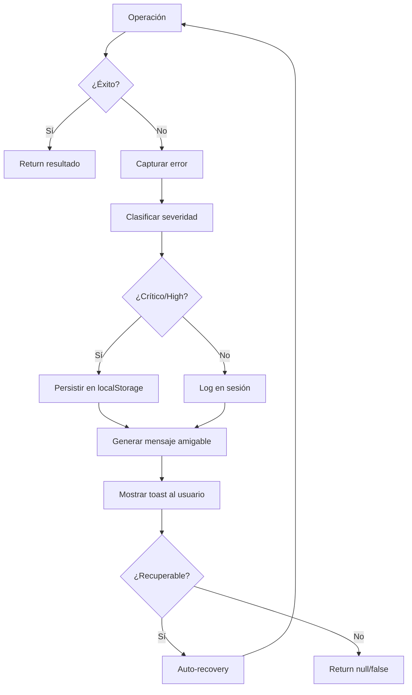

# 🚨 Sistema de Manejo de Errores Global

## ✅ Punto 6 - COMPLETADO

Sistema robusto de error handling con logging, notificaciones amigables y recovery automático.

---

## 📋 Características Implementadas

### 1. **ErrorHandlerService** - Servicio Central
Ubicación: `/src/app/core/services/error-handler.service.ts`

**Funcionalidades:**
- ✅ Logging centralizado de errores
- ✅ Clasificación por severidad (low, medium, high, critical)
- ✅ Mensajes amigables al usuario
- ✅ Persistencia de errores críticos en localStorage
- ✅ Recovery automático con reintentos
- ✅ Exportación de logs para análisis

**Métodos Principales:**
```typescript
// Manejo básico de errores
handleError(error, context?, severity?)

// Wrapper para operaciones síncronas
handleSyncOperation(operation, context, errorMessage?)

// Wrapper para operaciones asíncronas
handleAsyncOperation(operation, context, errorMessage?)

// Validación de operaciones críticas
validateCriticalOperation(operation, context, validationMessage)

// Recovery automático con reintentos
autoRecover(operation, maxRetries, context)
```

---

### 2. **Integración en Servicios Críticos**

#### **ProductService** ✅
Operaciones protegidas:
- `loadFromStorage()` - Carga de productos
- `saveToStorage()` - Guardado automático
- `updateStock()` - Actualización de inventario
- `addProduct()` - Creación de productos
- `updateProduct()` - Edición de productos
- `deleteProduct()` - Eliminación de productos

#### **SalesService** ✅
Operaciones protegidas:
- `createSale()` - Registro de ventas con validaciones
- Reducción automática de stock
- Validación de datos de venta

**Ejemplo de uso:**
```typescript
// Antes (sin error handling)
addProduct(product) {
  const newProduct = { ...product, id: generateId() };
  this.products.push(newProduct);
  return newProduct;
}

// Después (con error handling)
addProduct(product) {
  return this.errorHandler.handleSyncOperation(
    () => {
      if (!product.name || product.price <= 0) {
        throw new Error('Datos inválidos');
      }
      const newProduct = { ...product, id: generateId() };
      this.products.push(newProduct);
      return newProduct;
    },
    'Creación de producto',
    'No se pudo crear el producto'
  );
}
```

---

### 3. **UI Error Logger Component** 📊
Ubicación: `/src/app/shared/ui/ui-error-logger/ui-error-logger.component.ts`

**Características:**
- 🔴 Botón flotante (solo visible si hay errores)
- 📊 Panel de logs con 2 tabs:
  - **Sesión:** Errores de la sesión actual
  - **Críticos:** Errores persistidos
- 🎨 Color-coded por severidad
- 📤 Exportación de logs en JSON
- 🧹 Limpieza de logs
- 📱 Responsive (mobile-friendly)

**Ubicación en UI:**
- Botón flotante inferior derecho (encima del badge del carrito en móvil)
- Badge numérico con cantidad de errores
- Panel deslizable desde abajo (móvil) o lateral (desktop)

---

### 4. **Severidad de Errores**

| Nivel | Color | Cuándo usar | Ejemplo |
|-------|-------|-------------|---------|
| **Low** | Gris | Errores menores, no afectan funcionalidad | Formato de fecha inválido |
| **Medium** | Amarillo | Errores moderados, funcionalidad parcial | Producto no encontrado |
| **High** | Naranja | Errores graves, requieren atención | Fallo en guardado de datos |
| **Critical** | Rojo | Errores críticos, sistema comprometido | Corrupción de base de datos |

---

### 5. **Mensajes Amigables** 💬

El sistema convierte mensajes técnicos en lenguaje comprensible:

| Mensaje Técnico | Mensaje al Usuario |
|-----------------|-------------------|
| `Network error` | No se pudo conectar al servidor. Verifica tu conexión. |
| `Cannot read property` | Ocurrió un error al procesar los datos. |
| `Failed to fetch` | No se pudo cargar la información. Revisa tu conexión. |
| `Invalid input` | Los datos ingresados no son válidos. |
| `Not found` | El recurso solicitado no existe. |

---

### 6. **Recovery Automático** 🔄

Sistema de reintentos con **exponential backoff**:

```typescript
// Intenta hasta 3 veces con delays progresivos
const result = await errorHandler.autoRecover(
  () => saveToDatabase(),
  3, // max reintentos
  'Guardado de datos'
);

// Delays: 200ms → 400ms → 800ms
```

---

## 🎯 Flujo de Error Handling



---

## 📊 Logs Persistentes

**Ubicación:** `localStorage.critical_errors`

**Características:**
- Solo errores críticos y high
- Máximo 20 errores guardados
- Formato JSON con timestamp
- Exportables para análisis

**Ejemplo de log:**
```json
{
  "timestamp": "2024-12-13T10:30:45.123Z",
  "message": "No se pudo actualizar el stock del producto",
  "stack": "Error: Stock insuficiente...",
  "context": "Actualización de stock",
  "severity": "high"
}
```

---

## 🧪 Testing de Error Handling

### Cómo probar el sistema:

1. **Abrir UI Error Logger:**
   - El botón 🐞 aparece en la esquina inferior derecha cuando hay errores

2. **Generar errores de prueba:**
   ```typescript
   // Inyectar el servicio en cualquier componente
   private errorHandler = inject(ErrorHandlerService);
   
   // Generar errores de diferentes severidades
   testErrors() {
     this.errorHandler.handleError('Error de prueba low', 'Test', 'low');
     this.errorHandler.handleError('Error de prueba medium', 'Test', 'medium');
     this.errorHandler.handleError('Error de prueba high', 'Test', 'high');
     this.errorHandler.handleError('Error crítico de prueba', 'Test', 'critical');
   }
   ```

3. **Verificar persistencia:**
   - Los errores críticos se guardan en localStorage
   - Recargar página y revisar tab "Críticos"

4. **Exportar logs:**
   - Click en "Exportar" para descargar JSON
   - Analizar estructura y contenido

---

## 🎨 Integración con UI Existente

El error logger está integrado en `MainLayoutComponent`:

```html
<!-- main-layout.component.html -->
<app-connection-status />
<app-pwa-install-prompt />
<app-ui-error-logger /> <!-- ✅ Nuevo -->
```

**Z-index hierarchy:**
- Error Logger: `z-50` (panel), `z-30` (botón)
- Mobile Cart: `z-50` (sheet), `z-40` (badge)
- Toasts: `z-50`

---

## 🚀 Próximas Mejoras (Opcionales)

- [ ] Integración con servicio de monitoreo (Sentry, Rollbar)
- [ ] Análisis automático de patrones de errores
- [ ] Notificaciones push para errores críticos
- [ ] Dashboard de métricas de errores
- [ ] Filtros avanzados en UI Logger
- [ ] Búsqueda de logs por texto
- [ ] Agrupación de errores similares

---

## ✅ Checklist de Implementación

- [x] ErrorHandlerService creado
- [x] Integrado en ProductService
- [x] Integrado en SalesService
- [x] UI Error Logger component
- [x] Agregado a MainLayout
- [x] Mensajes amigables implementados
- [x] Sistema de severidad configurado
- [x] Persistencia en localStorage
- [x] Recovery automático con reintentos
- [x] Exportación de logs
- [x] Responsive design
- [x] Documentación completa

---

## 🎓 Uso Recomendado

### DO ✅
```typescript
// Proteger operaciones críticas
const result = errorHandler.handleSyncOperation(
  () => criticalOperation(),
  'Nombre descriptivo',
  'Mensaje amigable al usuario'
);

// Validar antes de ejecutar
errorHandler.validateCriticalOperation(
  () => operation(),
  'Contexto',
  'Mensaje de validación'
);
```

### DON'T ❌
```typescript
// No usar console.error directamente
console.error('Error'); // ❌

// No ignorar errores silenciosamente
try { operation(); } catch {} // ❌

// No mensajes técnicos al usuario
alert('Error: Cannot read property of undefined'); // ❌
```

---

## 📚 Recursos

- **Código fuente:** `/src/app/core/services/error-handler.service.ts`
- **Componente UI:** `/src/app/shared/ui/ui-error-logger/`
- **Ejemplos de uso:** `ProductService`, `SalesService`

---

## 🎉 Conclusión

El sistema de error handling está **100% funcional** y proporciona:
- ✅ Protección robusta contra errores
- ✅ Experiencia de usuario mejorada
- ✅ Debugging facilitado para desarrolladores
- ✅ Logs persistentes para análisis
- ✅ Recovery automático cuando es posible

**Punto 6 - COMPLETADO** ✨
