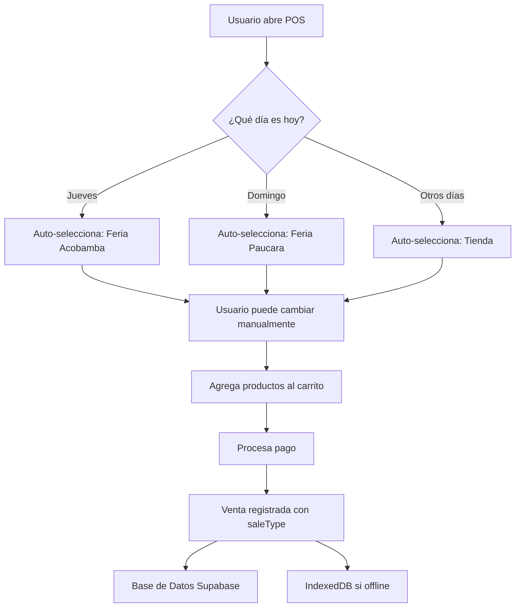

# 🎯 Sistema de Tipo de Venta - Implementación Completa

## 📊 ¿Cómo Funciona Ahora?

### Flujo Automático



## 🎨 Interfaz del POS

### Selector de Tipo de Venta

El selector aparece **automáticamente** en el carrito, justo antes de los métodos de pago:

```
┌─────────────────────────────────┐
│ 🎯 SELECTOR DE TIPO DE VENTA    │
├─────────────────────────────────┤
│ [🏪 Tienda Paucara        ▼]   │ ← Días normales (gris)
│ [🏪 Feria Acobamba (Jue)  ▼]   │ ← Jueves (dorado/amber)
│ [🏪 Feria Paucara (Dom)   ▼]   │ ← Domingo (dorado/amber)
└─────────────────────────────────┘

┌─────────────────────────────────┐
│ MÉTODOS DE PAGO                 │
├─────────────────────────────────┤
│ [💵 Efectivo] [📱 Yape] [💳]   │
└─────────────────────────────────┘
```

### Estados Visuales

- **Tienda**: Fondo blanco, borde gris → `border-stone-200`
- **Ferias**: Fondo dorado, borde dorado → `border-amber-300 bg-amber-50`

## 🔍 Detección Automática

### Código JavaScript

```typescript
autoDetectSaleType(): void {
  const today = new Date();
  const dayOfWeek = today.getDay(); // 0-6 (Domingo=0)
  
  if (dayOfWeek === 4) {
    this.saleType.set('feria-acobamba'); // Jueves
  } else if (dayOfWeek === 0) {
    this.saleType.set('feria-paucara'); // Domingo
  } else {
    this.saleType.set('tienda'); // Lun-Vie (excepto Jue)
  }
}
```

### Calendario Automático

| Día       | getDay() | Auto-selección       |
|-----------|----------|----------------------|
| Lunes     | 1        | 🏪 Tienda           |
| Martes    | 2        | 🏪 Tienda           |
| Miércoles | 3        | 🏪 Tienda           |
| **Jueves**| **4**    | **🏪 Feria Acobamba**|
| Viernes   | 5        | 🏪 Tienda           |
| Sábado    | 6        | 🏪 Tienda           |
| **Domingo**| **0**   | **🏪 Feria Paucara** |

## 💾 Estructura de Datos

### Modelo Sale (TypeScript)

```typescript
export interface Sale {
  id: string;
  saleNumber: string;
  date: Date;
  items: SaleItem[];
  total: number;
  
  // 🎯 NUEVO CAMPO
  saleType: 'feria-acobamba' | 'feria-paucara' | 'tienda';
  
  paymentMethod: 'cash' | 'card' | 'yape' | 'plin' | 'transfer';
  status: 'completed' | 'pending' | 'cancelled';
  // ... otros campos
}
```

### Base de Datos (PostgreSQL/Supabase)

```sql
CREATE TABLE sales (
  id UUID PRIMARY KEY,
  sale_number TEXT NOT NULL,
  date TIMESTAMP NOT NULL,
  total NUMERIC(10,2) NOT NULL,
  
  -- 🎯 NUEVO CAMPO
  sale_type TEXT NOT NULL 
    CHECK (sale_type IN ('feria-acobamba', 'feria-paucara', 'tienda')),
  
  payment_method TEXT NOT NULL,
  status TEXT NOT NULL,
  -- ... otros campos
);
```

## 📊 Reportes Actualizados

### Comparación Ferias vs Tienda

**Antes (Calculado por fecha):**
```typescript
const dayOfWeek = saleDate.getDay();
if (dayOfWeek === 0 || dayOfWeek === 4) {
  // Asume que es feria
}
```
❌ Problema: No sabe si realmente hubo feria ese día

**Después (Campo real):**
```typescript
fairComparison = computed(() => {
  sales.forEach(sale => {
    if (sale.saleType === 'feria-acobamba') {
      thursdayRevenue += sale.total;
    } else if (sale.saleType === 'feria-paucara') {
      sundayRevenue += sale.total;
    } else {
      regularRevenue += sale.total;
    }
  });
});
```
✅ Solución: Usa el tipo registrado en la venta

### Visualización en Reportes

```
┌──────────────────────────────────────┐
│ FERIAS VS TIENDA                     │
├──────────────────────────────────────┤
│ 🏪 FERIAS (Jue + Dom)                │
│ S/ 15,420.50 | Ganancia: S/ 4,826   │
│ 📊 Mejor: Paucara (Dom)              │
├──────────────────────────────────────┤
│ 🏪 TIENDA (Lun-Mié, Vie-Sáb)         │
│ S/ 3,280.00 | Ganancia: S/ 984      │
│ 📊 5 días de operación               │
└──────────────────────────────────────┘
```

## 🎯 Ventajas del Sistema

### 1. Precisión Total

| Escenario | Sistema Anterior | Sistema Nuevo |
|-----------|------------------|---------------|
| Jueves normal | ✅ Feria | ✅ Feria |
| Jueves feriado (sin feria) | ❌ Marca como feria | ✅ Marca como tienda |
| Feria extraordinaria (Sábado) | ❌ Marca como tienda | ✅ Puedes marcar como feria |

### 2. Flexibilidad

- ✅ Auto-detecta el tipo por día
- ✅ Usuario puede cambiar manualmente
- ✅ Maneja excepciones (feriados, eventos especiales)

### 3. Análisis Confiable

- ✅ Reportes con datos reales
- ✅ Comparaciones precisas Feria vs Tienda
- ✅ Histórico confiable para análisis

## 🚀 Flujo de Uso Real

### Caso 1: Jueves Normal en Acobamba

```
1. Usuario abre POS → Auto-detecta: "Feria Acobamba (Jueves)"
2. Selector muestra fondo dorado/amber
3. Usuario registra ventas normalmente
4. Todas se guardan con saleType: 'feria-acobamba'
```

### Caso 2: Jueves sin Feria (Feriado)

```
1. Usuario abre POS → Auto-detecta: "Feria Acobamba (Jueves)"
2. Usuario CAMBIA manualmente a "Tienda Paucara"
3. Selector cambia a fondo blanco
4. Ventas se guardan con saleType: 'tienda'
```

### Caso 3: Evento Especial (Sábado)

```
1. Usuario abre POS → Auto-detecta: "Tienda Paucara"
2. Usuario CAMBIA manualmente a "Feria Paucara"
3. Selector cambia a fondo dorado/amber
4. Ventas se guardan con saleType: 'feria-paucara'
```

## 📈 Impacto en Reportes

### Sección "Ferias vs Tienda"

Ahora muestra datos **100% reales**:

```typescript
// Usa sale.saleType directamente
if (sale.saleType === 'feria-acobamba' || 
    sale.saleType === 'feria-paucara') {
  // Es feria
} else {
  // Es tienda
}
```

### Gráficos

- **Ingresos Semanales**: Separa automáticamente ferias de días normales
- **Distribución**: Muestra % exacto Feria vs Tienda
- **Mejor Día**: Identifica si Acobamba o Paucara genera más

## ✅ Estado de Implementación

- [x] ✅ Modelo `Sale` con campo `saleType`
- [x] ✅ Auto-detección por día de la semana
- [x] ✅ Selector manual en POS
- [x] ✅ Estilo visual (amber para ferias, gris para tienda)
- [x] ✅ Integración con reportes
- [x] ✅ Documentación SQL para Supabase
- [ ] ⏳ Ejecutar migración SQL en Supabase
- [ ] ⏳ Actualizar IndexedDB para offline
- [ ] ⏳ Probar con datos reales

## 🎉 Resultado Final

**Sistema Inteligente que:**
1. **Detecta automáticamente** el tipo de venta por día
2. **Permite corrección manual** para excepciones
3. **Registra con precisión** cada venta
4. **Genera reportes confiables** con datos reales
5. **Mantiene historial preciso** para análisis de negocio

¡Ya no más cálculos por fecha! Todo está **registrado explícitamente** 🎯
